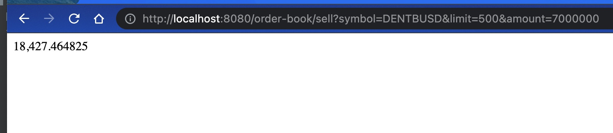
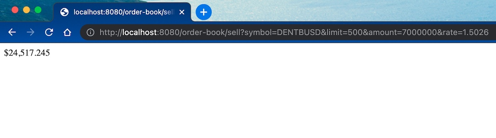

# binance-rest
Restful services consuming Binance API

----

**Introduction**

Have you ever been doing spot trading in **Binance** and is afraid to click that Buy/Sell button because you don't know 
 how many coins you are going to get in the trade from the current Order Book in real time?

Fear not, the _restful service_ in this project will do exactly that by getting the current Order Book data from Binance 
then does all the calculations to estimate the amount of coins you will get for executing the Sell/Buy order, an estimate 
since real time order book can change at any second. 

**How to Run**

Identify the symbol of trading pair you want to trade on. For example, BTCUSDT is the symbol of trading pair for BTC and 
USDT. Then visit url of online Binance API to confirm there is open Order Book for this trading pair, e.g.
https://api.binance.com/api/v3/depth?limit=100&symbol=BTCUSDT.

After that, check out this project, build executable jar file in console with the command:
$ mvn clean package

This should create a target folder containing the executable jar file binance-rest.jar. To start up the application, 
simply run the following command in console inside the folder containing jar file:
$ java -jar binance-rest.jar

**How to Use**

* The following HTTP GET request parameters are used in the service:
  * symbol: Symbol of the trading pair
  * limit: number of asks/bids data on offer to retrieve from Binance Open Book for the trading pair above
  * amount: number of coins to trade
  * rate: For Sell order only. Use this to estimate fiat value of your traded coins, e.g. for trading pair 
    BTCUSDT, the coins acquired after Sell order will be USDT, since each USD ~ $1.502 NZD, use rate=1.502 to 
    estimate NZD value of the coins acquired after trade.

    
* **Sell Order service**
  * This can be called in browser with a simple HTTP GET using request parameters described above. For example, open a 
    browser then visit the URL http://localhost:8080/order-book/sell?symbol=DENTBUSD&limit=500&amount=7000000&rate=1.502 
    to get estimate of the value of BUSD acquired in NZD after executing a Sell order of 7 million DENT. Remove the 
    request parameter string '&rate=1.502' if only wish to see the number of BUSD coins acquired after sell.
  * 
  * Example 1: Number of BUSD acquired for executing Sell order of 7,000,000.00 DENT

    
  *
  * Example 2: Profit for executing Sell order of 7,000,000.00 DENT by using request parameter 'rate', i.e. 1 BUSD = 1 USD ~ 1.5026 NZD

    

* **Buy Order service**
  * This can be called in browser with a simple HTTP GET using request parameters described above. For example, open a
    browser then visit the URL http://localhost:8080/order-book/buy?symbol=HOTBUSD&limit=500&amount=1000
    to get estimate of HOT acquired after executing a Buy order with 1000 BUSD.

    
* **Tips:** 
  * Use a free, testing tool like Postman to create and save Sell/Buy requests so one can simply call service by 
    clicking a button without typing or 'copy & paste' in browser address bar
  * Log files are in /log folder
  * Change default port 8080 by changing the port specified in /src/main/resources/application.yml then do a build to 
    generate new executable jar
  * URL of Binance API(i.e. https://api.binance.com/api/v3/depth) is specified in application-dev.yml. Change as required.
  * Report bugs found and I will fix it. Request a feature you like to see, no guarantee I can/will implement it... :)

**Disclaimer:** 

Use this at your own risk. I am not responsible for the loss of your fund in any way if you do use this software to make a
Buy/Sell order decision in Binance. :)

**Warning:** 

Crypto market is super volatile, trading is basically glorified gambling, much worse than Share trading. Don't invest 
if you don't have the stomach to lose $. Only buy what you can afford to lose. Definitively don't dip your toe in Crypto
if you are too lazy to: do your own research, learn new tricks, keep yourself up to date in the latest news or trend of 
what's going on... Just stay away if you don't have good common sense, does FOMO buy, ...

**Still Reading?**

OK, I will keep going...
Stay away from dodgy exchanges(cough, HitBTC...). There are many of these. Do your own research. A quick google or search 
in reddit forums should steer you away from these. They can basically lock up your fund or make it disappear in their 
exchanges for whatever reason & you wouldn't be able to do a thing...

Always have exit plans ready to cash out designated Crypto assets to fiat quickly when things start to go sour. Failing 
to do so could watch your portfolio shrink to peanuts within 1~2 weeks. Easiest way to do this is to trade your altcoins 
to stable coins in Binance/DEX quickly then relax as each stable coin is backed by one USD. One can then cash out stable 
coins to fiat in no hurry.

Watch out for the Tax man/lady (IRD)! Always keep records of your trades and work out the crypto tax to pay. Consider
using a paid software like https://cointracking.info/ to do the tax calculations for you. Failing to pay tax you risk 
having your profit taken away by IRD after cashing out big time to bank accounts. 

If you have a good run, cash out crypto to save up enough fiat to prepare paying for both Residential Income Tax(RIT) & 
Provisional Tax in NZ ASAP. Why? One could rack up a huge Crypto gain(hence tax) by trades easily during Bull run without 
making real money in bank account, then BANG! Bitcoin crashed, now you don't have enough real money to pay for that huge 
crypto tax except to sell Crypto assets at low prices that hurt your eyes. You could get out of this by not reporting 
Crypto gain to IRD of course, but remember what Dirty Harry used to say '_Do you feel Lucky Punk_'?
